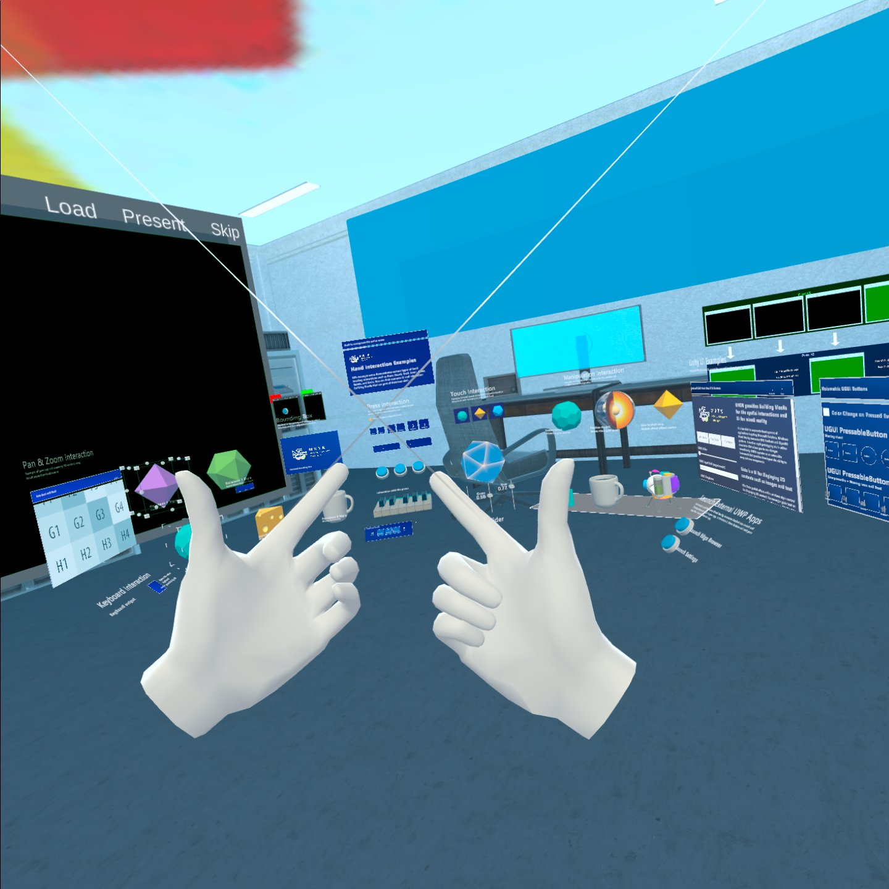

# Virtual Control Room, University of Haifa

Final Project for "Computer Graphics Lab" course, Department of Computer science, Haifa University. 

  

## Motivation
A security control room brings together the elements of a security operation and offers a logical way to coordinate the effects of security systems, personnel and responseoptions. A security control roomcontaining monitoring and controlsystems can commonly be found in:
* Universities, Hotels, Banks, Shopping Malls, Industrial sites, Airports, Ports.

I suggest implementing the same capabilities but in a virtual way, and saving place, money, and equipment. you can find the full project proposal [here](References/ProjectProposal.pdf).

* Project Weekly Report can be found [here](References/ComputerGraphicLab_Weekly_Report_Progress.pdf).
* Virtual Control Room Phase1 clip can be found [here](References/VirtualControlRoomPhase1.mp4)
* Virtual Control Room Final clip can be found [here](References/VirtalControlRoomFinalFeatures.mp4)

## Getting Started

See [Get Started](References/GetStartedandInstructions.pdf) file for the first step instructions.

### Prerequisites

Oculus:
We will use Oculus quest 2 standalone VR headset that works without an expensive PC and a boring cable. See [Oculus Quest 2](https://www.oculus.com/quest-2/)
Unity:
*	Visit unity.com and create new [Personal free account](https://store.unity.com/#plans-individual)
*	[Download](https://unity.com/download) Unity hub setup file (unity hub is an application that manages your Unity projects)
* [Side Quest](https://sidequestvr.com/)

### Installing

After cloning the project you need to install dependeces packages that I used to develop the application:
* [MRTK toolkit](https://docs.microsoft.com/en-us/windows/mixed-reality/mrtk-unity/?view=mrtkunity-2021-05)
* [WebRTC, Real-time communication for the web](https://webrtc.org/)

## Deployment

Oculus is running Android OS. the final project application apk can be found [here](https://drive.google.com/file/d/1lVNyeeyPJBk923pJXaRDPgfr3hW4IqcM/view?usp=sharing)

## Authors

* **Hussen Abu Hamad** - *Student of master degree in Computer Science*
* **Dr. Roi Poranne** - *Computer Graphics Lab's lecturer*

See also the list of [contributors](https://github.com/your/project/contributors) who participated in this project.

## License

This project is licensed under the MIT License - see the [LICENSE.md](LICENSE.md) file for details

